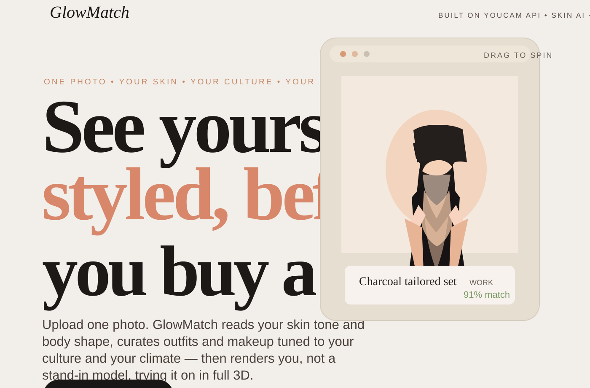

# GlowMatch



GlowMatch is a personalized fashion and beauty recommender that helps shoppers discover outfit and makeup choices based on their real features, cultural context, weather, and occasion. A user uploads a photo, the app reads their skin profile, matches body shape and style preferences, and recommends looks that are more likely to fit, flatter, and feel authentic to their identity.

This project is designed to turn a generic shopping experience into a more trusted, retail-ready decision support tool for fashion, beauty, and outfit discovery.

## Why this project matters

Online shopping often fails because shoppers cannot answer two key questions confidently:

- Will this look actually suit my skin tone and undertone?
- Will this outfit fit my shape, body proportions, and cultural style preferences?

GlowMatch solves that by combining: 

- skin analysis from a user photo
- profile inputs such as body shape, country, culture, occasion, weather, and budget
- curated outfit recommendations tailored to the user
- a virtual try-on preview showing how the selected outfit appears on the person
- a 3D avatar showcase for a more immersive product view

This creates clear consumer value for both retail and beauty commerce: it reduces uncertainty, improves product fit perception, and increases confidence before purchase.

## Core features

- Photo-based skin analysis
- Personalized outfit and makeup recommendations
- Culture-aware styling logic
- Occasion, weather, and climate-aware suggestions
- Virtual try-on rendering
- 3D avatar display for product exploration
- Mock checkout flow for demo purposes
- Responsive web interface

## How the app works

1. The user uploads a front-facing photo.
2. The app captures skin-related information and style preferences.
3. Recommendations are generated based on body shape, culture, country, event, and climate.
4. The user selects a recommended look.
5. The virtual try-on flow renders the outfit onto the uploaded image.
6. A 3D avatar preview can also showcase the same look in a rotating model.

## Retail value of GlowMatch

Most people do not need more fashion inspiration — they need clarity. They want to know what actually suits them: which colors flatter their skin tone, which silhouettes work with their body shape, what feels appropriate for the season, and what makes sense for the occasion they are dressing for.

That is where GlowMatch creates real value. Instead of giving generic style advice, it helps people answer the question that matters most: “What should I wear that truly fits me?”

GlowMatch brings personalization into the decision-making process by combining a user’s photo, skin profile, body shape, cultural context, climate, and occasion. It turns styling from guesswork into a more confident, informed choice. That matters because shoppers are not just looking for ideas — they are looking for reassurance. They want to feel good in what they wear, and they want to trust that the recommendation is relevant to their life, not just fashionable in theory.

For retailers and beauty brands, this creates a clear commercial opportunity. Personalized recommendations reduce uncertainty, improve product discovery, and help customers make faster, more confident purchase decisions. When a shopper feels understood, they are more likely to buy, explore more products, and return with greater trust in the brand.

In a market full of generic fashion apps and chatbots, GlowMatch stands out because it is built around real personal fit — not just trends. It helps customers shop with more confidence, and helps brands deliver a more human, relevant, and conversion-friendly experience.

## Tech stack

- Frontend: React + Vite + Tailwind CSS
- 3D rendering: React Three Fiber / Three.js
- Backend: Node.js + Express
- APIs: YouCam, Gemini, and optional styling AI services

## Repository structure

```text
Wardrobe-website-main/
├── backend/          Node.js API and AI integrations
│   ├── .env          Environment variables for API keys
│   ├── server.js     Express server entry point
│   ├── routes/       API routes
│   ├── utils/        AI client and recommendation logic
│   └── middleware/   upload and image-related middleware
├── frontend/         React app
│   ├── src/          UI and app logic
│   ├── index.html    HTML entry point
│   └── package.json
├── README.md         Project documentation
├── README(1).md      Additional copy/version file
└── package files etc.
```

## Required setup to run the project

Follow these steps before launching the app.

### 1. Install backend dependencies

```bash
cd backend
npm install
```

### 2. Create your environment file

Copy the example environment file and fill in the values you need:

```bash
cd backend
copy .env.example .env
```

Then update the values in [.env](backend/.env) for the services you want to use.

At minimum, the app depends on the following environment variables:

- `PORT`
- `FRONTEND_ORIGIN`
- `YOUCAM_API_KEY`
- `YOUCAM_API_BASE_URL`
- `GEMINI_API_KEY`
- `GEMINI_MODEL`
- `GEMINI_API_KEY_2` for the multi-agent recommendation pipeline
- `GEMINI_MODEL_2`

If you do not configure the live AI services, the app may fall back to deterministic mock or rules-based behavior, but the full personalized experience is enabled only when the API keys are set correctly.

### 3. Install frontend dependencies

```bash
cd ../frontend
npm install
```

### 4. Start the backend

```bash
cd ../backend
npm run dev
```

The backend runs by default on:

```text
http://localhost:8787
```

### 5. Start the frontend

Open a second terminal and run:

```bash
cd frontend
npm run dev
```

The frontend typically runs on:

```text
http://localhost:5173
```

### 6. Verify the app is running

Check the backend health endpoint:

```bash
curl http://localhost:8787/api/health
```

Expected response:

```json
{ "ok": true }
```

Then open the frontend URL in the browser to use the product flow.

## Environment notes

- Do not expose your real API keys in the frontend.
- Keep all secret values in the backend environment file.
- The backend is the only place that should make requests to third-party AI and image-processing services.
- For local development, `FRONTEND_ORIGIN` is usually set to `http://localhost:5173`.

## Useful commands

### Backend

```bash
cd backend
npm install
npm run dev
npm start
```

### Frontend

```bash
cd frontend
npm install
npm run dev
npm run build
```

## Production build

To validate the frontend build:

```bash
cd frontend
npm run build
```

## Notes for demo use

This project is designed to demonstrate a strong end-to-end shopping experience:

- upload a personal image
- analyze the skin and body profile
- recommend culturally relevant looks
- preview the outfit on the user
- present a 3D version of the style

It is especially well suited for a retail, beauty-tech, or fashion-tech demo where the key message is: personalized styling with higher purchase confidence.

## Summary

GlowMatch turns a standard outfit recommendation flow into a more personalized, retail-ready customer experience. It helps users make better choices based on their actual features and context, while giving brands a more intelligent and confidence-building product exploration flow.

